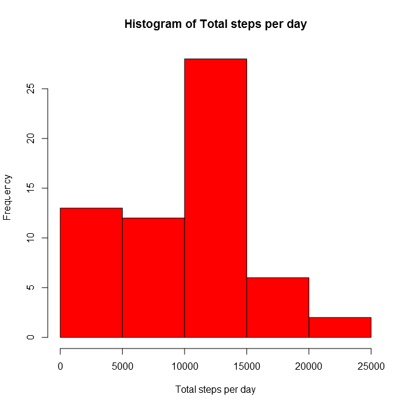
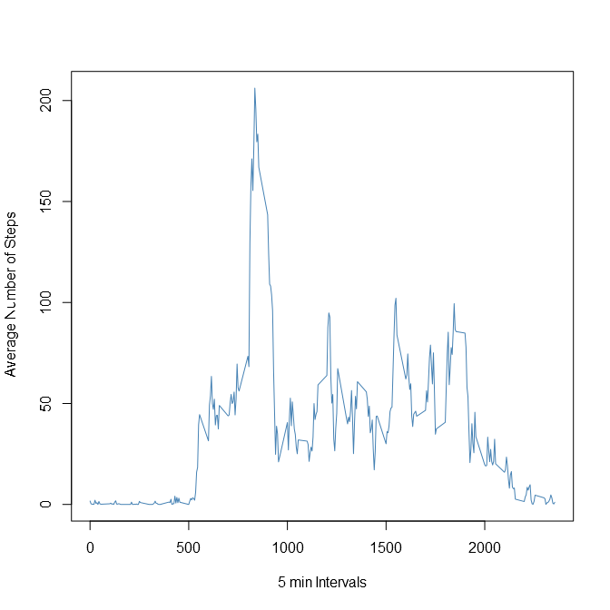
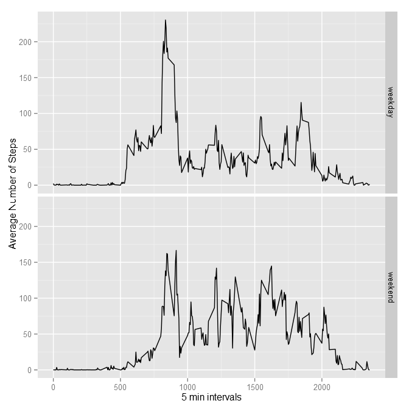

Reproducible Research - Assignment 1
====================================
### Introduction  
This assignment report consists of several parts that describe:
- original data
- loading and preprocessing the data  
- answering several questions about the data  
- creating plots to explore the data and support the answers/inferences  

The corresponding R code, results and plots are embedded in this report to make this research easily reproducible.

This assignment makes use of data from a personal activity monitoring device. This device collects data at 5 minute intervals through out the day. The data consists of two months of data from an anonymous individual collected during the months of October and November, 2012 and include the number of steps taken in 5 minute intervals each day.

### Data

The data for this assignment can be downloaded from the course web site:

Dataset: [Activity monitoring data][1] [52K]
The variables included in this dataset are:  

**steps:** Number of steps taking in a 5-minute interval (missing values are coded as NA)

**date:** The date on which the measurement was taken in YYYY-MM-DD format

**interval:** Identifier for the 5-minute interval in which measurement was taken

The dataset is stored in a comma-separated-value (CSV) file and there are a total of 17,568 observations in this dataset.

###Loading and preprocessing the data

Let's download and unzip the file


```r
URL<-"https://d396qusza40orc.cloudfront.net/repdata%2Fdata%2Factivity.zip"
download.file(URL, destfile="data.zip",method="curl")
unzip("data.zip")
```

Now let's read the file and save the results into ```data``` data.frame


```r
data<-read.csv("activity.csv", header=TRUE, sep=",")
```

Let's check that data.frame

```r
head(data)
```

```
##   steps       date interval
## 1    NA 2012-10-01        0
## 2    NA 2012-10-01        5
## 3    NA 2012-10-01       10
## 4    NA 2012-10-01       15
## 5    NA 2012-10-01       20
## 6    NA 2012-10-01       25
```
I suspect that ```date``` column isn't in the right format. Let's check

```r
class(data$date)
```

```
## [1] "factor"
```
Let's convert it into Date format

```r
data$date<-as.Date(data$date, format="%Y-%m-%d")
class(data$date)
```

```
## [1] "Date"
```

Just in case, let's check class of steps

```r
class(data$steps)
```

```
## [1] "integer"
```
and class of interval

```r
class(data$interval)
```

```
## [1] "integer"
```

### What is mean total number of steps taken per day?
For this part of the assignment, we can ignore the missing values in the dataset.
First let's load ```dplyr``` package

```r
library(dplyr)
```

So let's answer the first question: calculate the total number of steps taken per day and create a  histogram of the total number of steps taken each day. In order to do that we will first use ```group_by``` function to group data based on days and then we will apply ```summarize``` function to calculate total number of steps per each day.

```r
days<-group_by(data, date)
data_days<-summarize(days, totalsteps=sum(steps, na.rm=TRUE))
head(data_days, 10)
```

```
## Source: local data frame [10 x 2]
## 
##          date totalsteps
## 1  2012-10-01          0
## 2  2012-10-02        126
## 3  2012-10-03      11352
## 4  2012-10-04      12116
## 5  2012-10-05      13294
## 6  2012-10-06      15420
## 7  2012-10-07      11015
## 8  2012-10-08          0
## 9  2012-10-09      12811
## 10 2012-10-10       9900
```
here's the histogram of the total number of steps taken each day


```r
hist(data_days$totalsteps, col="red", xlab="Total steps per day", main="Histogram of Total steps per day")
```

 

Now let's calculate and report the mean and median of the total number of steps taken per day

```r
mean(data_days$totalsteps, na.rm=TRUE)
```

```
## [1] 9354.23
```

```r
median(data_days$totalsteps, na.rm=TRUE)
```

```
## [1] 10395
```

###What is the average daily activity pattern?
In order to answer this question we will need to make a time series plot of the 5-minute interval (x-axis) and the average number of steps taken, averaged across all days (y-axis). But first we need to organize our data. Let group the observations based on ```interval``` variable and then calculate average number of steps taken across all days per each interval.


```r
intervals<-group_by(data, interval)
data_intervals<-summarize(intervals, avgsteps=mean(steps, na.rm=TRUE))
head(data_intervals)
```

```
## Source: local data frame [6 x 2]
## 
##   interval  avgsteps
## 1        0 1.7169811
## 2        5 0.3396226
## 3       10 0.1320755
## 4       15 0.1509434
## 5       20 0.0754717
## 6       25 2.0943396
```
Now let's see the so-called "daily activity pattern"

```r
plot(data_intervals, type="l", xlab="5 min Intervals", ylab="Average Number of Steps", col="steelblue")
```

 


Now in order to interpret this graph we need to understand how to read X-axis (interval). Let's take a look at the data again

```r
head(data,15)
```

```
##    steps       date interval
## 1     NA 2012-10-01        0
## 2     NA 2012-10-01        5
## 3     NA 2012-10-01       10
## 4     NA 2012-10-01       15
## 5     NA 2012-10-01       20
## 6     NA 2012-10-01       25
## 7     NA 2012-10-01       30
## 8     NA 2012-10-01       35
## 9     NA 2012-10-01       40
## 10    NA 2012-10-01       45
## 11    NA 2012-10-01       50
## 12    NA 2012-10-01       55
## 13    NA 2012-10-01      100
## 14    NA 2012-10-01      105
## 15    NA 2012-10-01      110
```
and the last chunk

```r
tail(data)
```

```
##       steps       date interval
## 17563    NA 2012-11-30     2330
## 17564    NA 2012-11-30     2335
## 17565    NA 2012-11-30     2340
## 17566    NA 2012-11-30     2345
## 17567    NA 2012-11-30     2350
## 17568    NA 2012-11-30     2355
```
Notice that the last two digits show minutes (5, 10, ...35...55) and the first digits show hours (0 omitted). Thus the interval "105" correspond to 1:05am and interval "2335" corresponds to 11:35pm or 23:35. The number of 5-min intervals per day should be equal to 288, let's do a spot check

```r
dim(data[data$date=="2012-10-15",])
```

```
## [1] 288   3
```
Now when we now how to read interval axis we can say that peak corresponds to early morning and overall activity happens during a day slowing down at night hours.
Let's find out which 5-minute interval, on average across all the days in the dataset, contains the maximum number of steps?

```r
filter(data_intervals, avgsteps==max(avgsteps, na.rm=TRUE))
```

```
## Source: local data frame [1 x 2]
## 
##   interval avgsteps
## 1      835 206.1698
```
835 corresponds to 8:35am - naturally the maximum activity is probably related to the morning commute.


###Imputing missing values
The presence of NA's may introduce bias into some calculations or summaries of the data.
Let's calculate and report the total number of missing values in the dataset (i.e. the total number of rows with NAs)

```r
summary(is.na(data))
```

```
##    steps            date          interval      
##  Mode :logical   Mode :logical   Mode :logical  
##  FALSE:15264     FALSE:17568     FALSE:17568    
##  TRUE :2304      NA's :0         NA's :0        
##  NA's :0
```
As we can see only steps column contains NA values and the number of rows with NA values is 2304
Let's fill in all of the missing values in the dataset using the average number of steps we calculated for a particular interval across all days that contained ```steps``` data

```r
data.f<-data%>%group_by(interval)%>%mutate(steps=replace(steps, is.na(steps),mean(steps, na.rm=TRUE)))
head(data.f)
```

```
## Source: local data frame [6 x 3]
## Groups: interval
## 
##       steps       date interval
## 1 1.7169811 2012-10-01        0
## 2 0.3396226 2012-10-01        5
## 3 0.1320755 2012-10-01       10
## 4 0.1509434 2012-10-01       15
## 5 0.0754717 2012-10-01       20
## 6 2.0943396 2012-10-01       25
```

```r
sum(is.na(data.f$steps))
```

```
## [1] 0
```

Using the new dataset let's create the histogram of the total number of steps taken each day and calculate and report the mean and median total number of steps taken per day.

```r
data_days2<-data.f%>%group_by(date)%>%summarize(totalsteps=sum(steps, na.rm=TRUE))
hist(data_days2$totalsteps, col="red", xlab="Total steps per day", main="Histogram of Total steps per day")
```

 


```r
mean(data_days2$totalsteps, na.rm=TRUE)
```

```
## [1] 10766.19
```

```r
median(data_days2$totalsteps, na.rm=TRUE)
```

```
## [1] 10766.19
```
As we can see the mean and median changed from the previous dataset (with NA). Since we replaced NA values with average number of steps for that interval the new mean and median of total steps per day naturally increased. In addition to that the distribution becomes more "gaussian" and we don't have that bias towards left on the histogram like we had in the previous dataset. We also can notice that mean and median coincide for 
the new dataset.

### Are there differences in activity patterns between weekdays and weekends?
In order to answer this question we need to create two plots that will show average number of steps per interval for weekdays vs weekend days.

First, let's prepare our data. Let's take the ```data.f``` dataset (without NA values) and add one more column called ```weekday```

```r
data_3<-mutate(data.f, weekday=weekdays(date))
head(data_3)
```

```
## Source: local data frame [6 x 4]
## Groups: interval
## 
##       steps       date interval weekday
## 1 1.7169811 2012-10-01        0  Monday
## 2 0.3396226 2012-10-01        5  Monday
## 3 0.1320755 2012-10-01       10  Monday
## 4 0.1509434 2012-10-01       15  Monday
## 5 0.0754717 2012-10-01       20  Monday
## 6 2.0943396 2012-10-01       25  Monday
```
Then we will use ```group_by``` functions to group observations based on intervals

```r
intervals3<-group_by(data_3, interval)
```
Now let's split our data into two datasets: work vs weekend (based on weekday)

```r
work<-filter(intervals3, weekday  %in% c("Monday", "Tuesday", "Wednesday", "Thursday", "Friday"))
weekend<-filter(intervals3, weekday  %in% c("Saturday","Sunday"))
```
Now let's calculate average number of steps per interval in each subset

```r
work_avg<-summarize(work, avgsteps=mean(steps))
weekend_avg<-summarize(weekend,avgsteps=mean(steps))
```
Let's add a ```day``` column that will serve as "weekday" vs "weekend" indicator

```r
work_avg<-mutate(work_avg, day="weekday")
weekend_avg<-mutate(weekend_avg, day="weekend")
```
Now we're ready to merge two datasets together


```r
alldays_avg<-rbind(work_avg, weekend_avg)
```

Ok, with data ready we can now plot two activity patterns to see any differences


```r
library(ggplot2)
g<-ggplot(alldays_avg, aes(x=interval, y=avgsteps))
gl<-g+geom_line()+facet_grid(day~.)+labs(x="5 min intervals")+labs(y="Average Number of Steps")
print(gl)
```

 

There are some observations we can make about these two patterns:  
*  the activity starts earlier on weekdays and later on weekends (I also like to sleep more on weekends)  
*  it looks like the morning spike on weekends is not as high as it is for weekdays (perhaps because fewer people need to commute to work on weekends)  
*  there is more activity during the day on weekends than on weekdays (I like to walk around on weekends too compare to sitting in the office during the day on weekdays)   
*  on weekends the activity slow down later than on weekdays (party time!)  

That's all.
I hope you enjoy reading my research.

[1]: https://d396qusza40orc.cloudfront.net/repdata%2Fdata%2Factivity.zip
